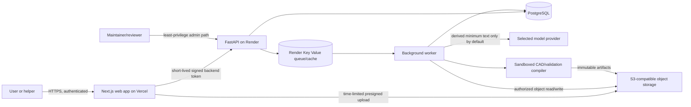

# AccessForge Threat Model and Data-Flow Inventory

Version: 0.1  
Status: Phase 0 draft  
Last updated: 2026-08-08

## 1. Scope

This model covers the planned hosted product: Next.js on Vercel, FastAPI and workers on Render, Render PostgreSQL/Key Value, S3-compatible object storage, model providers, template execution, authenticated users, helpers, professional reviewers, and maintainers.

No production services or real participant media are connected in Phase 0.

## 2. Data classes

| Class | Examples | Default treatment |
| --- | --- | --- |
| Public | documentation, reviewed template metadata, release notes | public after review |
| Account | user ID, OAuth identity, membership, billing-free settings | restricted; minimum retention |
| Private project | task text, measurements, requirements, candidate designs | project-scoped; private by default |
| Sensitive media | photos/videos/audio showing people, homes, health-related context | encrypted restricted object storage; short retention |
| Secret | OAuth secrets, signing keys, provider API keys, encryption key | secret manager/environment only; never logs |
| Safety/audit | risk decisions, approvals, recalls, deletion events | restricted immutable audit trail |
| Published community | user-approved anonymized template/example/dataset contribution | explicit opt-in; license and provenance visible |

## 3. Planned data flow

## 4. Trust boundaries

1. Browser to Vercel: browser is untrusted; protect sessions, CSRF-sensitive mutations, XSS, and user-controlled file metadata.
2. Vercel to Render API: verify short-lived asymmetric token, exact audience/issuer, origin, rate, and project authorization.
3. Browser to object storage: presigned URL is capability-limited, short-lived, content-limited, and checksum-checked.
4. API/worker to database/queue: service credentials and object-level authorization; queue payloads contain IDs, not secrets or raw media.
5. Worker to model provider: outbound network is controlled; user-provided content is untrusted; provider credentials are decrypted just in time.
6. Worker to CAD compiler: compiler is isolated, no network, bounded resources, read-only reviewed template release.
7. Community/template boundary: uploaded or contributed templates are untrusted until reviewed and signed.
8. Maintainer boundary: admin actions are rare, audited, least-privilege, and protected by stronger authentication.

## 5. Threats and controls

### T-001 Broken object-level authorization

Threat: a user changes a project, asset, candidate, or artifact ID and reads another user’s data.

Controls:

- enforce project/organization membership in every service-layer query
- use negative authorization tests for every object endpoint
- never authorize based only on frontend visibility
- use opaque IDs and avoid exposing guessable sequential identifiers

### T-002 Private media exposure

Threat: a public object URL, long-lived presigned URL, preview cache, log, or error trace reveals sensitive media.

Controls:

- private object prefixes/buckets by default
- short operation-specific presigned URLs
- no private objects in CDN/public cache
- content-disposition and content-type set deliberately
- redact EXIF and previews where feasible
- scrub URLs and payloads from logs
- deletion job plus periodic orphan-object reconciliation

### T-003 Malicious or oversized upload

Threat: polyglot file, decompression bomb, malicious archive, huge video, or parser exploit harms the worker.

Controls:

- magic-byte validation and allowlisted decoders
- content-length, duration, pixel-count, archive-depth, and decompression limits
- quarantine before processing
- no arbitrary archive extraction
- sandbox media decoders and keep dependencies patched
- rate limits and per-project quotas

### T-004 Prompt injection through user content

Threat: text, transcript, image metadata, or community content instructs an agent to ignore rules, access tools, or reveal secrets.

Controls:

- delimit all project content as untrusted data
- explicit prompt-injection instructions
- typed tool allowlist with server-side authorization
- deterministic risk rules outside the model
- no shell, arbitrary URL, filesystem, or secret tools
- golden prompt-injection fixtures

### T-005 Unsafe model output

Threat: malformed units, fabricated measurements, dangerous parameter values, or confident language enters a design.

Controls:

- Pydantic/JSON Schema validation
- source-reference validation
- unknown values stay unknown
- parameter range enforcement in the compiler
- deterministic pre/post risk checks
- human confirmation before candidate and export

### T-006 Provider key compromise

Threat: API key is leaked in browser storage, logs, traces, job arguments, database, build output, or error messages.

Controls:

- server-only deployment keys
- AES-256-GCM for per-user keys
- only encrypted credential references in jobs
- secret redaction tests
- key test/revoke/delete UI
- rotation and incident runbook

### T-007 SSRF through custom model endpoint

Threat: a user-provided base URL targets internal services, metadata endpoints, localhost, or a private network.

Controls:

- HTTPS only and URL credential rejection
- allowlist in hosted mode
- reject loopback, private, link-local, and reserved addresses after DNS resolution
- re-check resolution at connection time
- redirect disabled and outbound timeout/port policy
- separate unsafe self-hosted opt-in

### T-008 Arbitrary code in community templates

Threat: a template reads secrets, reaches the network, modifies another job, or consumes unlimited resources.

Controls:

- only signed reviewed releases execute in hosted production
- no uploaded Python execution in MVP
- declarative template format or isolated sandbox before ecosystem expansion
- no network, read-only inputs, bounded CPU/memory/time
- fixture and security tests
- template revocation path

### T-009 CAD/parser resource exhaustion

Threat: malicious or pathological geometry causes worker denial of service.

Controls:

- parameter ranges and complexity budgets
- per-job CPU, memory, wall-time, and output-size limits
- isolated disposable workspace
- queue concurrency limits
- deterministic cancellation and retry classification

### T-010 Unauthorized publication

Threat: private project or design becomes public through a default toggle, race, or admin action.

Controls:

- publication is a separate explicit consent flow
- default private
- show exact fields/assets and license before publish
- two-step confirmation for media/dataset publication
- audit event and reversible unpublish where technically possible

### T-011 Destructive deletion failure

Threat: deletion UI claims success while media, backups, derived artifacts, or provider copies remain.

Controls:

- deletion job with durable status and retry
- object inventory/orphan reconciliation
- document provider-retention limitations before sending data
- provide export before deletion
- never hide partial deletion

### T-012 Privileged maintainer abuse

Threat: an admin can view sensitive data or change safety rules without review.

Controls:

- least privilege and time-bound access
- separate safety/admin roles
- audit every access/export/risk-rule/template action
- require review for safety/template release changes
- no routine access to raw media

## 6. Security and privacy acceptance gates

Before Phase 1 deployment:

- no secrets in git history or example files
- auth token issuer/audience/expiry tests exist
- project authorization matrix is defined
- local object storage uses private buckets and presigned URLs
- development seed data is synthetic

Before any pilot:

- retention/deletion behavior is exercised
- upload/parser limits are tested
- threat model has owners for all high-risk threats
- provider data-use and retention terms are reviewed
- incident and hazard-report paths are reachable

Before public launch:

- independent security review or proportionate penetration test
- dependency/container scanning and SBOM
- backup/restore and deletion drill
- custom endpoint SSRF test suite
- template sandbox/review process
- public privacy notice and data inventory

## 7. Residual risks

- No automated media redaction is perfect; users must understand that originals may contain identifying context.
- Model-provider retention and training policies vary; per-provider disclosures are required.
- Physical validation cannot cover every user, material, printer, environment, or failure mode.
- Open-source self-hosted deployments may be configured unsafely; documentation must distinguish supported hosted controls from operator responsibility.
- The product may be perceived as medical or certified despite disclaimers; scope, copy, and visual design must continually counter that misunderstanding.

