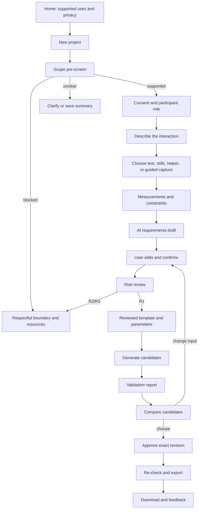

# AccessForge Low-Fidelity Workflow and Content Model

Version: 0.1  
Status: Phase 0 draft; no visual-design implementation yet  
Last updated: 2026-08-08

## 1. Design intent

The first experience should feel like a careful co-design conversation with a transparent engineering notebook, not an autonomous machine making a mysterious object.

The user should understand at every step:

- what AccessForge knows
- what it is guessing
- what the user can change
- what it cannot assess
- why a question is being asked
- what will happen to their data

## 2. Primary workflow

## 3. Screen inventory and copy

### Home

Headline: **“Make everyday objects easier to use, with you in control.”**

Supporting copy: “AccessForge helps you describe a low-risk access difficulty, explore a reviewed adapter template, and see what was checked. It is early-stage software—not a medical device or safety certification.”

Primary action: `Start a private project`  
Secondary action: `See supported uses`  
Persistent link: `Privacy`, `Safety limits`, `How it works`

### New project

Prompt: **“What would you like to be able to do?”**

Helper text: “Describe the outcome in your own words. You do not need to name a diagnosis or explain your body.”

Actions: `Continue`, `Save and return later`

### Scope pre-screen

Prompt: **“A few questions help us avoid unsafe suggestions.”**

Ask about action, object, environment, load, age/user context, and whether the object is part of a safety system. Explain that unknown answers pause generation rather than being treated as safe.

Blocked copy: **“We cannot generate this type of part in AccessForge.”** Follow with the reason, what can be saved, and a professional/resource category where appropriate.

### Consent

Heading: **“Choose what you want to share.”**

Separate choices: project text, still images, video, helper access, AI-provider sharing, community publishing, future contact. Default every optional choice to off.

### Capture

Heading: **“Show only what feels comfortable.”**

Actions: `Use text only`, `Upload still images`, `Record a short clip`, `Invite a helper`.

Never use “required video” language. Include `Skip this step`.

### Measurements

Heading: **“Measurements are suggestions, not a test.”**

Each row displays: value, unit, method, tolerance, source, confirmation, and `I don’t know yet`.

### Requirements review

Heading: **“Check what AccessForge understood.”**

Each card shows:

- `You told us`
- `Measured`
- `Suggested by AccessForge`
- `Template default`

Actions: `Edit`, `Confirm`, `I’m not sure`, `Ask me a different question`.

### Risk review

Heading: **“What this project can and cannot assess.”**

Show evidence-based rows, not a single score. Use `Passed`, `Needs confirmation`, `Not assessed`, and `Blocked`.

### Candidate comparison

Heading: **“Choose a design direction to inspect.”**

For each candidate show size, parameter changes, known tradeoffs, validation status, manufacturing notes, and limitations. The 3D viewer is optional; the structured report is equivalent.

### Export

Heading: **“Review before downloading.”**

Confirmation text: “You are approving candidate [ID], generated from requirements revision [ID]. These checks passed: [list]. These properties were not assessed: [list]. This is not professional safety certification.”

Action: `Approve and export this revision`.

## 4. Content rules

- Use plain language and short sentences.
- Explain why a question matters.
- Never imply that a blocked request is unreasonable.
- Never say “safe design”; say “checks completed” and “limitations.”
- Keep user facts, inferred facts, template defaults, and reviewer findings visually distinct.
- Always offer a way to go back without losing data.
- Ask one high-value question at a time when possible.
- Use the participant’s chosen terms for disability and access needs.

## 5. State and error patterns

Every asynchronous screen needs:

- queued state with expected next step
- running state with text progress
- waiting-for-user state with one clear action
- succeeded state with evidence
- failed state with cause category, retry/cancel path, and support route
- cancelled state with recovery path

Do not show an indefinite spinner without text, timeout, or recovery.

## 6. Phase 0 prototype deliverable

Create a text-only clickable flow or annotated wireframe before polished styling. It must cover the supported, ambiguous, blocked, retry, deletion, and accessibility-alternative paths. Use synthetic content only.

